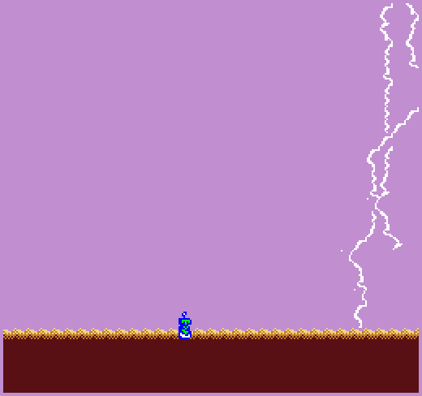

# ElectroBot

Author: Lucas

Design: While not quite a game yet, this demo uses a spin on Wang Tiles to generate 
naturalistic looking lightning.

Screen Shot:

How Your Asset Pipeline Works:

1. I first create the sprites in GIMP, making sure to use a specific 4 color palette
(where transparent maps to the 0th (generally transparent) color, blue maps to the 1st color, 
green maps to the second, and pure red/white maps to the 3rd value color.)
I export this as a png into the dist/assets folder. All the sprites are stored in
one large sprite atlas, and are accessed with indices.

2. I then make use of the load_png function provided to us to convert the atlas
to a vector or u8vec4s in asset_loader.cpp. I then shuffle the data around and do bitwise operations so
that each tile is stored contiguosly, first as a bit0 array and then as a bit1 array as
the Tile struct specifies. I think write that to the binary file atlas.bin

3. In PlayMode.cpp, I read from atlas.bin to get the tile data. Because I moved 
the data around to match the Tile data structure in my asset converter file, 
I read from the .bin directly into tiles.data(), no buffer or parsing required.

The asset_converter can be called from the command line by running with the -l
flag (eg ./dist/game.exe -l)

How To Play:
Use arrow keys to move left and right, and use space to jump.

This game was built with [NEST](NEST.md).

